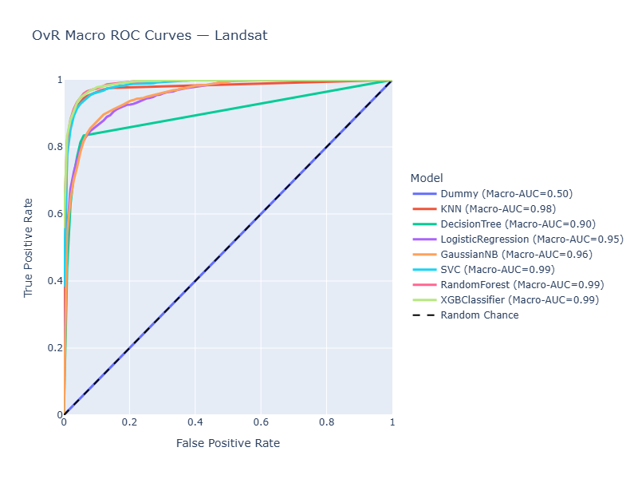
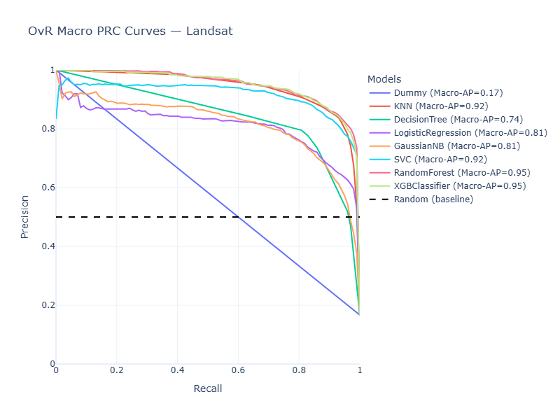

# DA5401: Assignment 7 — Landsat Multi-Class Classification

## Student Details

* **Name:** Chirag
* **Roll Number:** DA25M008

---

## Overview

This assignment applies and compares a range of **supervised machine learning algorithms** on the **Landsat Satellite dataset** for multi-class land-cover classification.
The goal is to evaluate the models using both **threshold-dependent** and **threshold-independent** metrics, and to analyze their behavior through comparative performance visualizations.

---

## Methodology

1. **Dataset:**

   * Files: `sat.trn`, `sat.tst` (pre-split training and test sets)
   * Features: 36 spectral attributes
   * Target: Land-cover class (6 categories)

2. **Preprocessing:**

   * Label encoding for categorical targets
   * Feature standardization using `StandardScaler`

3. **Models Evaluated:**

   * Logistic Regression
   * Support Vector Classifier (RBF kernel)
   * K-Nearest Neighbors
   * Decision Tree
   * Random Forest
   * Gaussian Naive Bayes
   * XGBoost Classifier
   * Dummy Classifier (stratified baseline)
   * Brownie models: Inverted Logistic Regression, Shuffled Logistic Regression

4. **Evaluation Metrics:**

   * **Threshold-dependent:** Accuracy, Weighted F1-score
   * **Threshold-independent:** Macro, Micro, and Weighted ROC-AUC; Macro, Micro, and Weighted Average Precision (PRC-AUC)

---

## Results Summary

| Rank | Model               | Accuracy | Weighted F1 | Macro ROC-AUC | Macro AP |
| :--: | :------------------ | :------: | :---------: | :-----------: | :------: |
|   1  | Random Forest       |  0.9115  |    0.9094   |     0.9901    |  0.9517  |
|   2  | XGBClassifier       |  0.9050  |    0.9030   |     0.9900    |  0.9509  |
|   3  | KNN                 |  0.9045  |    0.9037   |     0.9786    |  0.9217  |
|   4  | SVC                 |  0.8955  |    0.8925   |     0.9850    |  0.9177  |
|   5  | Decision Tree       |  0.8505  |    0.8509   |     0.9002    |  0.7366  |
|   6  | Logistic Regression |  0.8210  |    0.7935   |     0.9540    |  0.8116  |
|   7  | Gaussian NB         |  0.7965  |    0.8036   |     0.9551    |  0.8105  |
|   8  | Dummy (Baseline)    |  0.2305  |    0.0864   |     0.5000    |  0.1667  |

### Brownie Models

| Model             | Accuracy | Weighted F1 | Macro ROC-AUC | Macro AP |
| :---------------- | :------: | :---------: | :-----------: | :------: |
| Inverted Logistic |  0.0005  |    0.0002   |     0.0460    |  0.0909  |
| Shuffled Logistic |  0.1000  |    0.0820   |     0.4113    |  0.1435  |

---

## Visualizations

### ROC Curves

*Macro-Averaged ROC Curves for all models.*

### PRC Curves

*Macro-Averaged Precision–Recall Curves for all models.*

---

## Insights

* Random Forest achieved the highest overall performance.
* XGBoost closely matched Random Forest across all metrics.
* SVC and KNN provided balanced multi-class performance.
* Brownie models validated the reliability of evaluation metrics.
* Macro-averaged ROC-AUC and PRC-AUC effectively captured overall model quality.

---

## Conclusion

This assignment demonstrates a complete workflow for **multi-class model evaluation** using a comprehensive metric set and visual diagnostics.
While **Random Forest** achieved the highest overall performance, **XGBoost** showed comparable results with strong generalization.
Beyond accuracy, **macro-averaged ROC-AUC and PRC-AUC** serve as the most reliable indicators of model performance in multi-class classification tasks.

---
